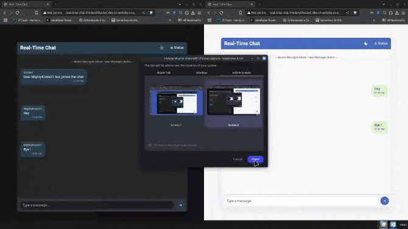
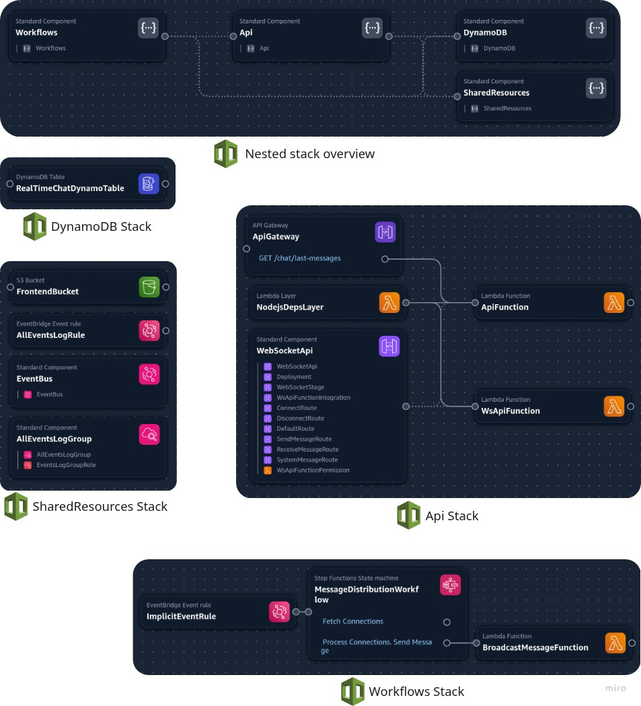

# Real-Time Chat Demo

A serverless real-time chat application built with AWS serverless services.

## Demo

<p align="center">
  
</p>

## Architecture

The application is built using the following AWS services:

- **API Gateway WebSocket API**: Handles real-time WebSocket connections
- **API Gateway REST API**: Provides HTTP endpoints for fetching message history
- **Lambda**: Processes chat messages and connection events
- **DynamoDB**: Stores connection information and message history
- **Step Functions**: Orchestrates message delivery workflow
- **EventBridge**: Enables event-driven communication between components
- **S3**: Hosts the frontend static assets

<p align="center">
  
</p>

## Features

- **Real-time Communication**: Instant message delivery via WebSockets
- **Message Persistence**: Complete message history stored in DynamoDB
- **User Presence**: Online/offline status indicators
- **Message History**: Load and display previous messages
- **Serverless Architecture**: Fully serverless with pay-per-use pricing
- **High Scalability**: Scales automatically to handle traffic spikes
- **Fault Tolerance**: Built-in error handling and retry mechanisms
- **Client-side Deduplication**: Prevents duplicate message display
- **Responsive Design**: Works on desktop and mobile devices

## Repository Structure

```bash
real-time-chat-demo/
├── api/                     # API Gateway and connection management
│   ├── template.yaml        # CloudFormation template for API
│   └── src/                 # Lambda functions for API endpoints
│       ├── aws-clients/     # AWS SDK client configurations
│       ├── entities/        # Domain entities (Connection, Message)
│       ├── fastify/         # REST API using Fastify framework
│       ├── functions/       # WebSocket handlers (connect, disconnect, send)
│       ├── lambdas/         # Lambda function entry points
│       └── shared/          # Shared utilities and helpers
├── db/                      # Database resources
│   └── template.yaml        # CloudFormation template for DynamoDB
├── docs/                    # Documentation assets
│   └── architecture-diagram.png # Architecture diagram
├── front/                   # Frontend code
│   ├── src/                 # Source code for the chat interface
│   │   ├── index.html       # Main HTML file
│   │   ├── style.css        # Styling for the chat interface
│   │   └── app.mjs          # JavaScript for WebSocket communication
│   └── deploy-frontend.sh   # Script to deploy frontend to S3
├── shared/                  # Shared infrastructure resources
│   └── template.yaml        # CloudFormation template for shared resources
├── workflows/               # Step Functions workflows
│   ├── template.yaml        # CloudFormation template for workflows
│   ├── src/                 # Source code for Lambda functions
│   │   ├── aws-clients/     # AWS SDK client configurations
│   │   ├── lambdas/         # Lambda function handlers
│   │   └── shared/          # Shared utilities
│   └── statemachine/        # Step Functions state machine definitions
│       └── message-distribution.asl.json    # Message distribution workflow
└── template.yaml            # Main CloudFormation template
```

## Deployment

### Prerequisites

- AWS CLI installed and configured
- Node.js 16+ and npm
- AWS SAM CLI (for deploying serverless applications)
- TypeScript knowledge for backend customization

### Deployment Steps

1. **Clone the repository**:
   ```bash
   git clone https://github.com/yourusername/aws-apigw-real-time-chat.git
   cd aws-apigw-real-time-chat
   ```

2. **Install dependencies**:
   ```bash
   cd api/src && npm install
   cd ../../workflows/src && npm install
   ```

3. **Deploy the application stack**:
   ```bash
   sam build
   sam deploy --guided
   ```

4 - Save the websocket url (wss://) and the API Gateway endpoint and add to the variables in the `front/src/app.mjs` file.
   ```bash
   export WEBSOCKET_URL=wss://your-websocket-url
   export API_ENDPOINT=https://your-api-endpoint
   ```

5 - Access the frontend deploy script (`front/scripts/deploy.sh`) and change the aws profile constant to your aws profile
   ```bash
   PROFILE="{{your-profile}}"
   ```

6 - **Deploy the frontend**:
   ```bash
   bash front/scripts/deploy.sh
   ```

## Architecture Deep Dive

The application follows an event-driven architecture with these main components:

1. **Connection Management**:
   - API Gateway WebSocket API handles client connections
   - Connection information stored in DynamoDB

2. **Message Processing**:
   - Messages sent via WebSocket are processed by a Lambda
   - EventBridge routes messages to appropriate workflows

3. **Message Distribution**:
   - Step Functions workflow coordinates message delivery
   - Lambda functions send messages to connected clients

4. **Message History**:
   - REST API provides endpoints to fetch message history
   - DynamoDB stores all messages with TTL for cleanup

## Performance Optimization

- Direct Lambda invocation for message delivery (lower latency than SQS)
- Client-side message handling to prevent duplicate messages
- Efficient WebSocket message format to minimize payload size
- Connection cleanup to handle stale connections

## Security Considerations

- Connections expire after 2 hours (API Gateway WebSocket limit)
- Messages stored with TTL to auto-expire old data
- IAM roles with least privileges for Lambda functions
- No personal data stored beyond session information

